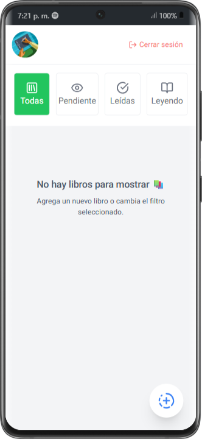
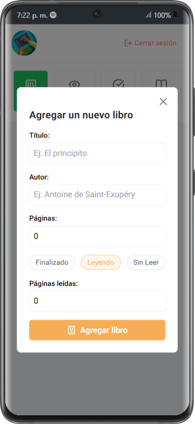
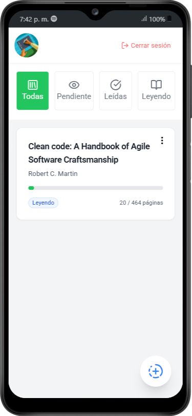
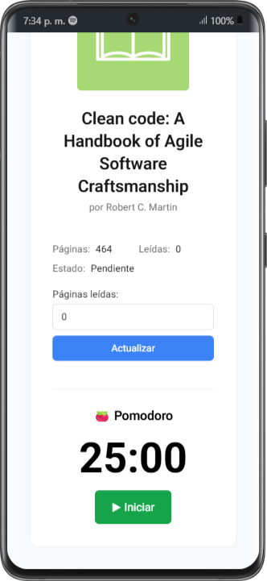
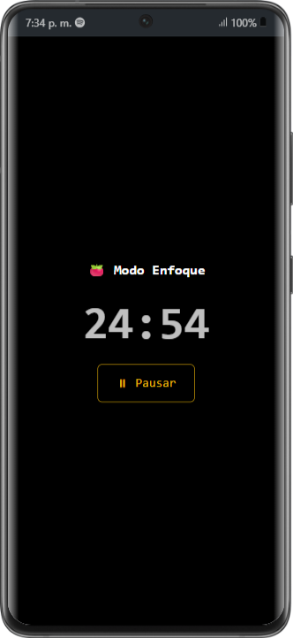
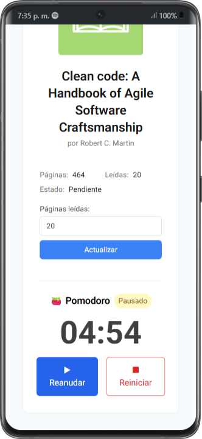
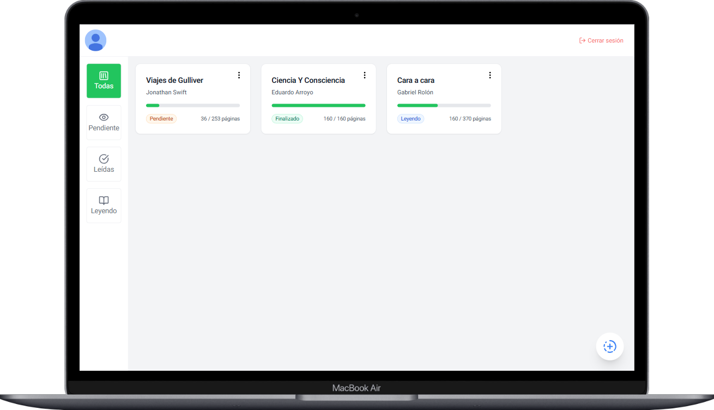
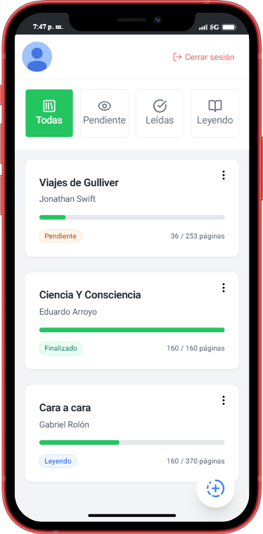

# 📚 BookTrack: Tu Compañero de Lectura Inteligente

[](https://book-tracker-fawn.vercel.app/)
[](https://nextjs.org/)
[](https://firebase.google.com/)
[](https://tailwindcss.com/)

**BookTrack** es una aplicación web minimalista y potente diseñada para transformar la forma en que gestionas tu hábito de lectura. Organiza tu biblioteca personal, monitorea tu progreso en tiempo real y mantén el enfoque con herramientas integradas de productividad.

> 🚀 **¡No pierdas más tiempo y comienza hoy!** → [Visita la aplicación aquí](https://book-tracker-fawn.vercel.app/)

---

## ✨ Características Principales

### 📖 Gestión de Biblioteca Personal
Administra tus libros con total facilidad. Guarda información detallada para cada título:
- **Título y Autor**: Organización clara desde el primer momento.
- **Control de Páginas**: Registro exacto de páginas totales y leídas.
- **Estados de Lectura**: Categoriza tus libros en *Pendiente*, *Leyendo* o *Finalizado*.

<div align="center">
  
  
</div>

### 📊 Seguimiento de Progreso Visual
Visualiza tu avance de un vistazo con indicadores dinámicos:
- **Barras de Progreso**: Gráficos suaves que muestran cuánto te falta para terminar.
- **Contador Dinámico**: Métricas precisas de páginas completadas.
- **Actualización Rápida**: Cambia tu progreso con un solo clic desde la vista detallada.

<div align="center">
  
</div>

### ⏱️ Cronómetro Pomodoro Integrado
Maximiza tu concentración durante las sesiones de lectura con nuestro temporizador especializado:
- **Enfoque Total**: Configura sesiones de 1 a 60 minutos según tus necesidades.
- **Alarmas Sonoras**: Notificaciones al finalizar para que sepas cuándo descansar.
- **Control Total**: Inicia, pausa y reinicia con una interfaz intuitiva.

<div align="center">
  
  
  
</div>

### 🔐 Seguridad y Personalización
- **Acceso con Google**: Inicio de sesión rápido y seguro.
- **Sincronización en la Nube**: Tus datos siempre disponibles, protegidos por Firebase.
- **Perfil Personalizado**: Una experiencia adaptada a tu usuario.

### 📑 Organización Inteligente
Filtra tu colección con un sistema jerárquico impecable:
- Ver **Todos** los libros.
- Filtrar por **Pendientes**, **En curso** o **Terminados**.

---

## 🎨 Diseño y Experiencia (UX/UI)
- **Diseño Responsive**: Optimizado para móviles, tablets y escritorio.
- **Animaciones Fluidas**: Desarrollado con Framer Motion para una experiencia premium.
- **Interfaz Moderna**: Estética limpia, modo oscuro sutil y tipografía legible.

<div align="center">
  
  <br>
  
</div>

---

## 🛠️ Stack Tecnológico

| Tecnología | Propósito |
| :--- | :--- |
| **Next.js 15+** | Framework de React con App Router para alto rendimiento. |
| **Firebase** | Autenticación y base de datos Firestore en tiempo real. |
| **Tailwind CSS** | Estilizado moderno, responsivo y mantenible. |
| **Framer Motion** | Animaciones suaves e interacciones dinámicas. |
| **Lucide React** | Librería de iconos minimalistas y elegantes. |

---

## 🚀 Comenzando

Sigue estos pasos para ejecutar el proyecto localmente:

```bash
# 1. Clona el repositorio
git clone https://github.com/bautistaJuan/BookTrack-.git

# 2. Instala las dependencias
npm install

# 3. Configura tus variables de entorno (.env.local) con tus credenciales de Firebase

# 4. Inicia el servidor de desarrollo
npm run dev
```

---

## 🤝 Contribuciones

¡Las ideas nuevas son siempre bienvenidas! Si deseas contribuir:

1. Haz un **Fork** del proyecto.
2. Crea una **Rama** para tu funcionalidad (`git checkout -b feature/NuevaFuncionalidad`).
3. Realiza un **Commit** de tus cambios (`git commit -m 'Añadir nueva funcionalidad'`).
4. Haz **Push** a la rama (`git push origin feature/NuevaFuncionalidad`).
5. Abre un **Pull Request**.

---

<p align="center">
  Desarrollado con ❤️ para amantes de la lectura.
</p>
