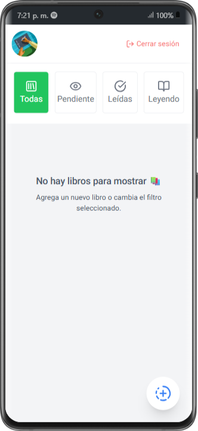
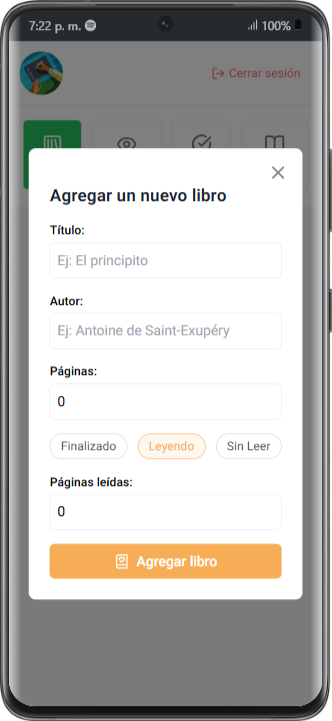
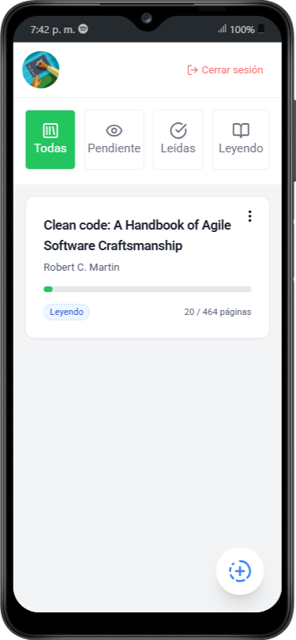
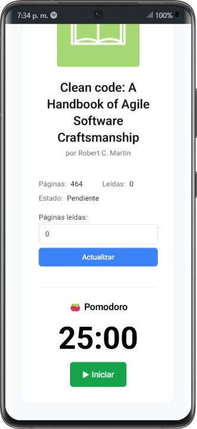
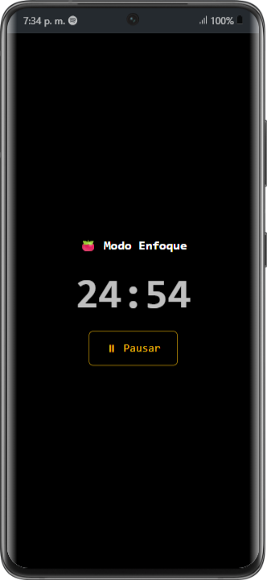
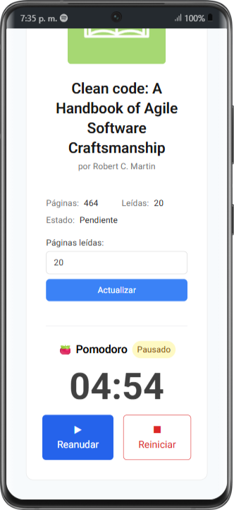
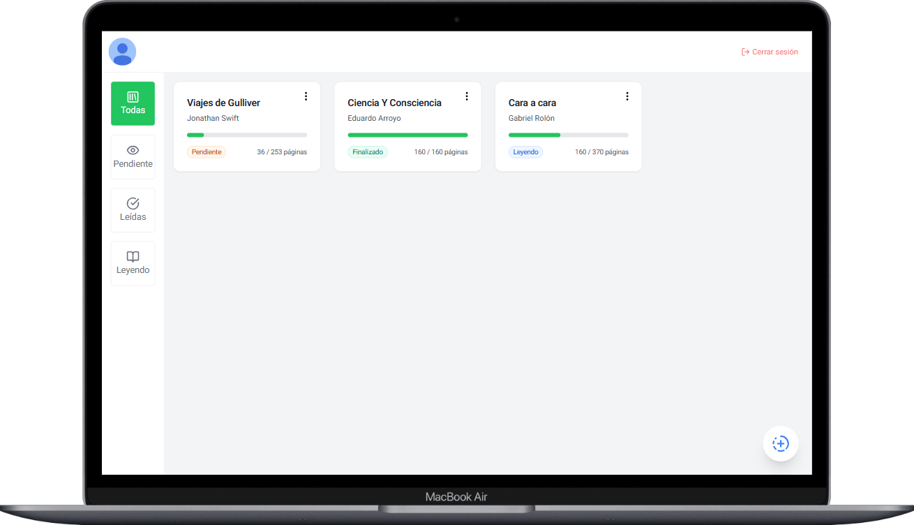
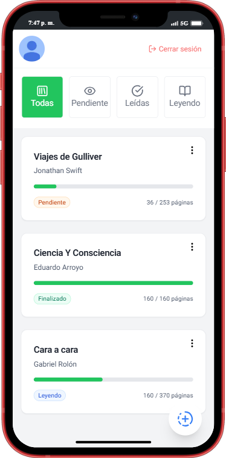

## 📚 Reading Tracker App

A minimalist web application to log, organize, and track your reading progress. Add books, update your progress, mark them as read or pending, and stay motivated on your reading journey!

> ⚠️ **Stop wasting time and go try it out → [Visit the app here 🚀](https://book-tracker-fawn.vercel.app/)**

## 📑 Table of Contents

- [📚 Project Features](#📚-project-features)
  - [1. Book Management](#1-book-management)
  - [2. Progress Tracking 📊](#2-progress-tracking-📊)
  - [3. Pomodoro Timer ⏱️](#3-pomodoro-timer-⏱️)
  - [4. Authentication 🔐](#4-authentication-🔐)
  - [5. Organization 📑](#5-organization-📑)
  - [6. User Interface 🎨](#6-user-interface-🎨)
- [🛠️ Technical Details](#technical-details-🛠️)
- [🤝 Contributing](#contributing-🤝)

## 📚 Project Features

### 1. Book Management

Allows adding books with the following information:

- Title
- Author
- Total number of pages
- Pages read
- Reading status (Pending, Reading, Finished)

<b>Screens:</b>




### 2. Progress Tracking 📊

- Displays reading progress for each book
- Visual progress bar
- Counter of pages read vs total
- Dynamic reading status updates

<b>Screens:</b>



### 3. Pomodoro Timer ⏱️

- Pomodoro-style timer for focused reading sessions
- Time configurable between 1–60 minutes
- Sound alarm when time is up
- Start, pause, and reset controls

<b>Screens:</b>





### 4. Authentication 🔐

- Google Sign-In
- Personalized user profile
- User-specific persistent data in the cloud

### 5. Organization 📑

Filter books by status:

- All books
- Pending
- Reading
- Finished

### 6. User Interface 🎨

- Responsive design
- Smooth animations
- Modal for adding/editing books
- Detailed book view
- Book cards with summarized info

<b>Screens:</b>




---

## Technical Details 🛠️

- **Framework:** Next.js 13+ with App Router
- **Database & Auth:** Firebase (Auth + Realtime Firestore)
- **State Management:** React Hooks (`useState`, `useEffect`, `useContext`)
- **Styling:** Tailwind CSS with responsive design and transitions
- **Component Architecture:** Modular and reusable components
- **Performance:** Optimized routing, conditional rendering
- **Deployment:** Vercel (recommended for Next.js apps)
- **Scalable Structure:** Clear module separation (`lib`, `components`, `app`)
- **Accessibility:** Proper color contrast, semantic tags, visible focus

---

## 🚀 Getting Started

````bash
# Clone the repository
git clone https://github.com/tu-usuario/booktrack.git

# Install dependencies
npm install

# Run the development server
npm run dev


## 🚀 Getting Started

```bash
# Clone the repository
git clone [https://github.com/tu-usuario/BookTrack-.git

# Install dependencies
npm install

# Run the development server
npm run dev
````

## Contributing 🤝

Feel free to fork the repository, make your changes, and submit a Pull Request (PR).

To contribute:

1. Fork the repo to your GitHub account.
2. Clone your fork locally.
3. Create a new branch for your feature or bugfix.
4. Commit your changes.
5. Push the branch to your fork.
6. Open a Pull Request here explaining your changes.

All contributions are welcome, and I appreciate your help in improving the project.
